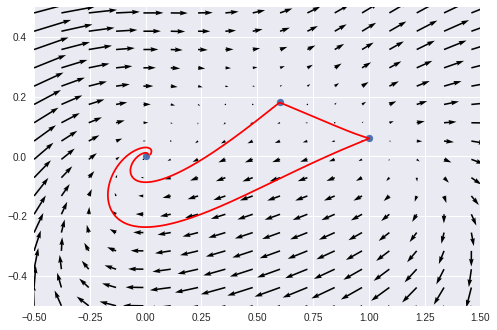

# Boundary Value Problem Solver using Collocation

## Introduction

We began with the following ODE system:

```math
\begin{split}
    v' &= v(v-1)+\Gamma (e-v e_{-}) \nonumber\\
    e' &= v[-\frac{(v-1)^{2}}{2} + e-e_{-}+\Gamma e_{-}(v-1)]\qquad\qquad(1)
\end{split}
```

where

```math
\begin{align}
  \Gamma &=\frac{5}{3}$\\
  e_{-} &=\frac{(\Gamma +2)(v_{+}-v_{*})}{2\Gamma (\Gamma +1)}\\
  v_{*} &= \frac{\Gamma}{\Gamma +2}\\
  v_{+} &=\frac{3}{5}.
\end{align}
```

Our goal was to calculate and classify the fixed points, provide a phase portrait, and create a boundary value problem solver that can solve this system. We then used this boundary value problem solver to solve for connecting orbits of the system. Our solver worked by collocating at Chebyshev nodes.

## Fixed Points

We identified three fixed points for our given system: $(0,0)$, $(0.6,0.18)$, and $(1,0.06)$.  We verified them both analytically and with code. In order to classify these fixed points, we found the Jacobian:

$$
J(v, e) = \begin{bmatrix}
2v-\Gamma e_{-} - 1 & \Gamma\\
\frac{-v(v-1)^2}{2} + e - e_{-} + \Gamma e_{-} (v-1) + v(\frac{-(v-1)^2}{2} - v(v-1) + \Gamma e_{-}) & v\\
\end{bmatrix}\\
$$

At each fixed point, we found the eigenvalues of the Jacobian, which yielded the following:

- $(0,0)$: $(-0.55+0.89302855j,-0.55-0.89302855j)$, stable spiral
- $(0.6,0.18)$: $(-0.4,1.1)$, unstable saddle
- $(1,0.06)$: $(0.53870124,1.36129876)$, unstable source

## Phase Portrait

Here is the phase portrait of equation (1).

<div align="center">

  
</div>

## Boundary Value Problem Solver

### Method

The method we used was collocation at Chebyshev nodes. But, what even is collocation?

To collocate, you first decide on a finite domain of possible solutions.  In our case, we selected the span of the Chebyshev polynomials. Second, you choose a finite number of collocation points. We chose the shifted Chebyshev roots for our interval. Finally, you find a function $f$ from the finite domain of possible solutions where $f$ satisfies the differential system at each of the collocation points.  In our case, we labeled $f$ as $S[A]$.

Our boundary value solver was designed to work for a wide class of boundary value problems.  To account for this wide array of problems, let $n$ represent the dimension of the system. (In the differential equation (1), $n$ is $2$).  Our collocating approximation was a vector of size $n$, where each entry was a linear combination of $K$ Chebyshev polynomials, $T_i (t)$.  Using this notation, we can give a more detailed description of $S[A]$:

```math
\begin{equation}
 S[A](t) = 
\begin{bmatrix}
\sum_{i=1}^{K} a_{1,i}T_i (t)\\
\vdots \\
\sum_{i=1}^{K} a_{n,i} T_i (t)
\end{bmatrix}
=
\begin{bmatrix}
a_{1,1} & \dots & a_{1,K} \\
\vdots & \ddots \\
a_{n,1} & \dots & a_{n,K}
\end{bmatrix}
\begin{bmatrix}
T_1 (t) \\
\vdots \\
T_K(t)
\end{bmatrix}.\qquad\qquad(2)
\end{equation}
```

The end goal of our solver was to find a matrix $A$ where

1. $S[A]$ collocated at the Chebyshev roots.
2. $S[A]$ satisfied the boundary conditions of the given boundary value problem.

This naturally leads to the question, "How does the solver do those things?"

### Summary of Solver

The solver was written as a class, constructed with the following arguments:
- `RHS` - the right hand side of a differential system
- $n$ - the dimension of the system
- $K$ - the number of Chebyshev polynomials to begin with in a candidate solution
- $(a, b)$ - interval to solve over, given as an array
- `etol` - an error tolerance 
- `BC` - a callable function that takes in the approximate solution, $S[A]$, and then returns a vector of error at the boundary conditions

We used these inputs to set up the following vector:

```math
\begin{equation}
    H(A) = 
    \begin{bmatrix}
    S[A]'(r_1) - \texttt{RHS}(S[A](r_1))\\
    S[A]'(r_2)-\texttt{RHS}(S[A](r_2)\\
    \vdots\\
    S[A]'(r_{K-2}) - \texttt{RHS}(S[A](r_{K-2}))\\
    \texttt{BC}(S[A])
    \end{bmatrix}\qquad\qquad(3)
\end{equation}
```

where $r_i$ is the $i^{th}$ shifted Chebyshev node $\forall ~ i \in [1,K-2]$. Note that a root of equation (3) collocates and satisfies the boundary conditions. Thus, we solved for the roots of equation (3) in order to come up with an approximate solution.

We made an initial guess for $A$, corresponding to Chebyshev polynomials equal to 1.  Then we passed the guess for $A$, and a function handle for $H(A)$ into the Levenberg-Marquardt algorithm to determine the roots of equation (3). We stored the output of the L-M algorithm as a matrix $\overline{A}$.

Our next step was determining whether $S[\overline{A}]$ satisfied our error tolerance. We approximated the error with

```math
\begin{equation*}
    \max\left\{ \left|S[\overline{A}]'(x_i) - \texttt{RHS}(S[\overline{A}](x_i))\right|  :  i\in\{1, 2, \ldots, 1000\} \right\}.
\end{equation*}
```

and checked to see if it was less than the error tolerance. Here, $x_i$ is the $i$th point out of 1000 evenly spaced points over $(a,b)$. If this error condition was met, we returned $S[\overline{A}]$ as our solution. If it wasn't, we doubled $K$, and repeated the same process. If the candidate solution didn't satisfy the error tolerance after a fixed number of iterations, we forced the solver to quit.

## Solution for Connecting Orbits

Once you've got a solver, solving for connecting orbits for (1) requires two more things: an interval to solve over, and a boundary condition function. For the interval, it would ideally be $(-\infty,\infty)$. However, after some trial and error, we found that $(-6,6)$ worked best for our solver. Next, the boundary condition function needs to have good boundary conditions.

For our first boundary condition, we wanted our solution to come in towards a fixed point. In other words, we wanted to approach the fixed point in the same direction as its eigenvector. To do this, we found a vector orthogonal to the fixed point's eigenvector, and then checked if the dot product between this and the tail end of candidate solution path was orthogonal.

Our second boundary condition was designed to deal with a rather annoying fact.  You see, several solutions trace out the same connecting orbit between two points.  To illustrate, let $\mathbf{y}(t)$ represent a solution of the differential system (1).  Notice that for any $c \in \mathbb{R}$, $\mathbf{y}(t-c)$ will also be a solution. Some of these solutions will trace out very little of the connecting orbit in an interval like $(-6, 6)$. So, we require the $v$-coordinate of our solution to be exactly halfway between the $v$-coordinates of the two fixed points.  We hoped that the solution would travel quickly in that region.  So, in backwards time our solution should make significant progress towards one fixed point, and in forwards time it should make significant progress towards the other fixed point. Our boundary condition function took care of this by taking in an entire candidate solution as an input, evaluating the candidate solution at $t=0$, and then returning the difference of the $v$-coordinate with the $v$-coordinate of the midpoint.
